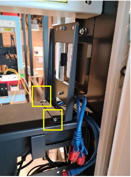
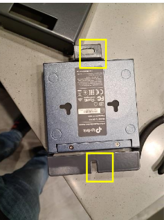
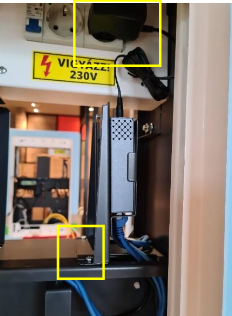
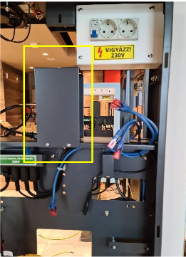
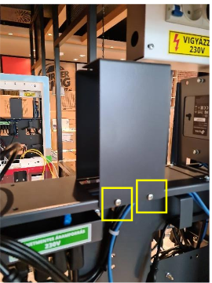
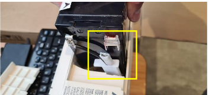
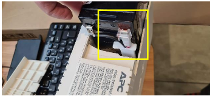
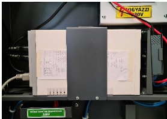

# 🍔 Burger King KIOSK -- Összeszerelési és Telepítési Útmutató

**Verzió:** 1.0\
**Dátum:** 2020-10-16\
**Karbantartó:** Bit-Soft Kft.

---

## 📚 Tartalomjegyzék

- [Switch beszerelése](#switch-beszerelése)
- [Szünetmentes tápegység
  beszerelése](#szünetmentes-tápegység-beszerelése)
- [Vonalkódolvasó beszerelése](#vonalkódolvasó-beszerelése)
- [PC összeszerelése](#pc-összeszerelése)
- [Bankkártya terminál tartó
  felszerelése](#bankkártya-terminál-tartó-felszerelése)
- [Monitor beszerelése](#monitor-beszerelése)
- [Nyomtató összeszerelése](#nyomtató-összeszerelése)
- [Szoftvertelepítés](#szoftvertelepítés)
- [PC boot probléma elhárítása](#pc-boot-probléma-elhárítása)

---

## Switch beszerelése

1.  Szereld ki a tartókeretet az alján található két csavar
    meglazításával.

    

2.  A kereten a felső csavart csavard ki, az alsót lazítsd meg, majd
    fordítsd el a pántot.

    

3.  Tedd be a switchet a keretbe, húzd meg a csavarokat, majd a keretet
    szereld vissza a KIOSK-ba.

    

4.  Dugd be a switchet a jobb oldali aljzatba.

    

5.  Csatlakoztasd az UTP kábeleket a switch portjaiba.

---

## Szünetmentes tápegység beszerelése

1.  Szereld ki a tartókeret előlapját.

    

2.  Kövesd a sárga figyelmeztető matricán lévő utasításokat.

    

3.  Helyezd be a szünetmentest a KIOSK-ba és rögzítsd az előlapot.

    

4.  Dugd be a tápot a bal oldali aljzatba.

    

5.  A tápcsatlakozókat dugd be kattanásig.

    

---

## Vonalkódolvasó beszerelése

1.  Csúsztasd a vonalkódolvasót a helyére és rögzítsd csavarokkal.

    

2.  Dugd rá az USB toldóra.

    

---

## PC összeszerelése

1.  Rögzítsd a tartófüleket mindkét oldalra (3-3 csavar).

    

2.  Csavarozd le az anyacsavarokat.

    

3.  Csatlakoztasd a soros kábeleket alul.

    

4.  Helyezd be a PC-t és rögzítsd.

    

5.  Rögzítsd a tápegységet.

    

6.  Csatlakoztasd az összes kábelt.

    

---

## Bankkártya terminál tartó felszerelése

1.  Csavard le a konzol oldalán lévő anyákat.

    

2.  Helyezd be belülről az ajtóba és rögzítsd.

    

---

## Monitor beszerelése

⚠️ **Két ember szükséges!**

1.  Távolítsd el a fóliákat.

    

2.  Csavard ki a pozícionáló csavarokat.

    

3.  Helyezd be a monitort (This side up).

    

4.  Rögzítsd 6 csavarral.

    

---

## Nyomtató összeszerelése

⚠️ **Csak Bitsoft-os műszerész szerelheti!**

1.  Akkumulátor csatlakoztatása az AEE tálcán.

    

2.  Kábelek csatlakoztatása.

    

3.  Nyomtató rögzítése a KIOSK-ban.

    

---

## Szoftvertelepítés

---

## PC boot probléma elhárítása

